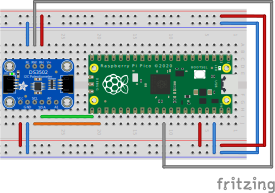

# Example DS3502 code with Raspberry Pi Pico and `embassy`

This folder contains example code using the `ds3502` driver with the Raspberry Pi Pico and the `embassy` framework.

## Pin Setup

| DS3502 Pin | RP Pico Pin | Note |
| --- | ---| --- |
| RW | Pin 27 | ADC |
| RL | GND ||
| RH | 3.3 V ||
| Vcc | 3.3 V ||
| GND | GND ||
| SDA | Pin 16 | I2C0 |
| SCL | Pin 17 | I2C0 |



## Building and flashing

This code is setup to be built and flashed in a single step using `probe-rs` and the Raspberry Pi Debug Probe. To build and flash, use the following command.

```bash
$ cargo run --release
# Compiling crates ...
    Finished `release` profile [optimized] target(s) in 12.04s
     Running `probe-rs run --chip RP2040 /data/src/ds3502/target/thumbv6m-none-eabi/release/pico-example`
      Erasing ✔ 100% [####################]  20.00 KiB @  61.79 KiB/s (took 0s)
     Finished in 0.78s
0.103133 [INFO ] ADC Value: 32, Wiper Value: 0, Voltage: 0.02578125 (pico_example pico-example/src/main.rs:36)
1.203523 [INFO ] ADC Value: 65, Wiper Value: 1, Voltage: 0.052368164 (pico_example pico-example/src/main.rs:36)
2.303872 [INFO ] ADC Value: 100, Wiper Value: 2, Voltage: 0.080566406 (pico_example pico-example/src/main.rs:36)
3.404221 [INFO ] ADC Value: 130, Wiper Value: 3, Voltage: 0.10473633 (pico_example pico-example/src/main.rs:36)
```
